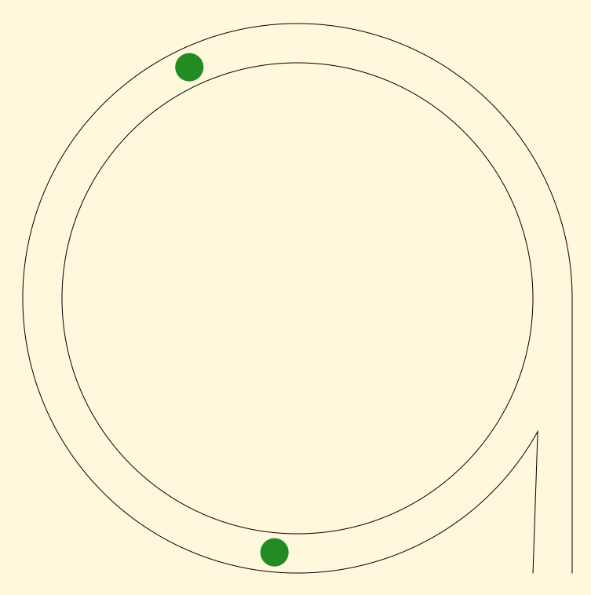
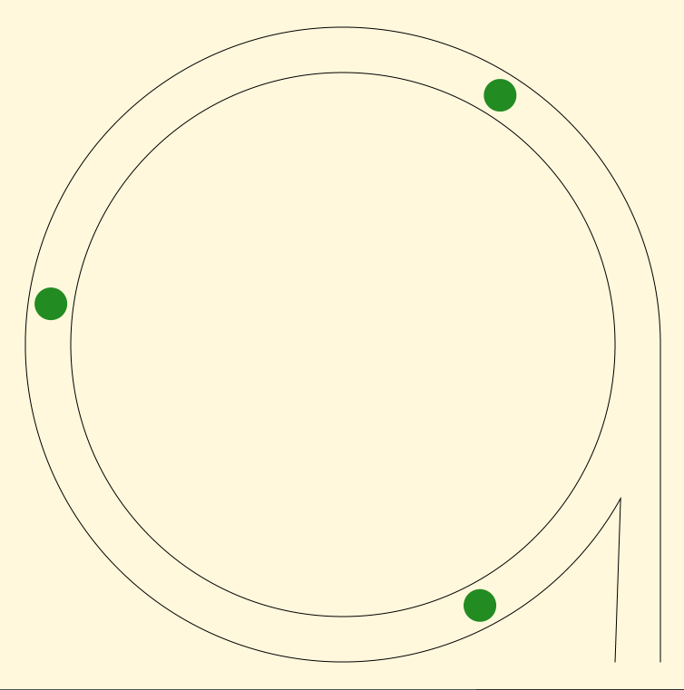
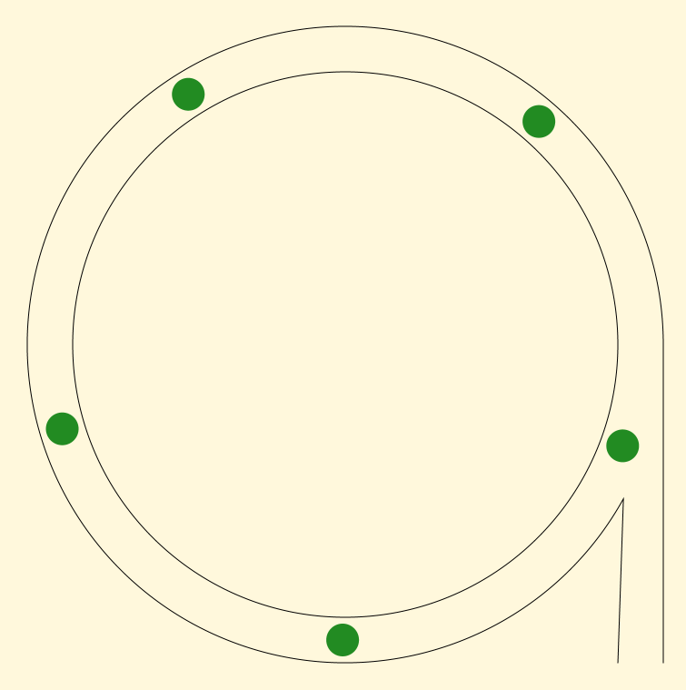
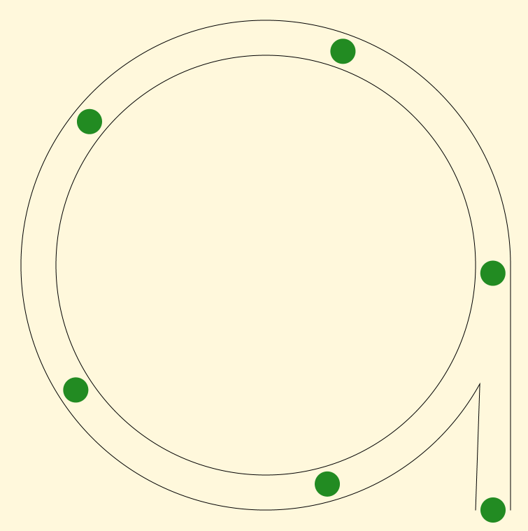

# TrafficFlow
Animates a simple traffic jam in a roundabout. Pressing Space inserts a new car.

## Building
You need OpenJDK 8 with support for JavaFX.

## Copyright and License
Copyright 2022 Paul Fuhrmann

This program is free software: you can redistribute it and/or modify it under the terms of the GNU General Public License Version 2 as published by the Free Software Foundation.

This program is distributed in the hope that it will be useful, but WITHOUT ANY WARRANTY; without even the implied warranty of MERCHANTABILITY or FITNESS FOR A PARTICULAR PURPOSE. See the GNU General Public License for more details.

You should have received a copy of the GNU General Public License along with this program. If not, see [here](http://www.gnu.org/licenses/).

## Screenshots

